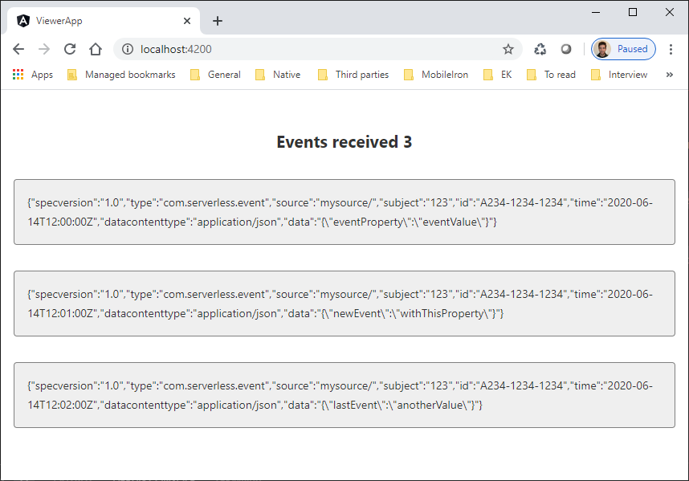

# Real-time EventGrid viewer with serverless SignalR

A simple real-time EventGrid viewer for CloudEventSchema v1.0. Back-end developed using serverless SignalR with Azure Function. Front-end developed using Angular 9.


## Getting started

### Prerequisites

- [Azure Function Core Tools](https://docs.microsoft.com/en-us/azure/azure-functions/functions-run-local?tabs=windows%2Ccsharp%2Cbash)
- [Angular CLI](https://angular.io/cli)
- [Azure CLI](https://docs.microsoft.com/en-us/cli/azure/install-azure-cli?view=azure-cli-latest)
- [Azure CLI - EventGrid extension](https://github.com/Azure/azure-cli-extensions)
- [ngrok](https://ngrok.com/) or similar

Some Azure resources must be created. Use following commands or create them directly from Azure Portal into your subscription:

1. **Azure SignalR** in serverless mode:

    ```bash
    az signalr create  --resource-group <your resource group> --name <your resource name>--sku Free_F1 --service-mode Serverless --location northeurope
    ```

2. **Event Grid Topic** with *CloudEventSchema v1.0*:

    ```bash
    az eventgrid topic create --resource-group <your resource group --name  <your resource name> --location northeurope --input-schema cloudeventschemav1_0
    ```

### Installing

#### Server-side

First lets prepare the Azure Function project. Rename `local.settings.sample.json` file to `local.settings.json`. Replace the value in property `AzureSignalRConnectionString` with the connection string from your SignalR serverless resource.

Run the Function host:

```bash
cd FunctionApp
func start
```

We need to subscribe this Azure Function to the Event Grid Topic. To make it possible we need to expose the localhost server. You can use `ngrok` or any other similar tool to accomplish it:

```bash
ngrok http 7071
```

The Azure Function is ready to subscribe to the Event Grid Topic. The Azure Function contains an endpoint for handling CloudEvents subscription: `api/CloudEventSubscription`. Create the subscription from Azure Portal or from the command line:

```bash
az eventgrid event-subscription create --source-resource-id /subscriptions/<your subscription id>/resourceGroups/<your resource group>/providers/Microsoft.EventGrid/topics/<your topic> --name serverless-signalr-function --endpoint <your tunnel to 7071 port>/api/CloudEventSubscription --endpoint-type webhook --event-delivery-schema cloudeventschemav1_0
```

#### Client-side

Build and serves the viewer app:

```bash
cd viewer-app
ng serve
```

Open your app in any browser: http://localhost:4200/

Once everything is in place you can test it sending a sample event to the EventGrid Topic:

```bash
cd FunctionApp
curl --request POST --header "Content-Type: application/cloudevents+json; charset=utf-8" --header "aeg-sas-key: <your topic key>" --data @event.json <your topic url>
```



## License

This project is licensed under the MIT License - see the [LICENSE](LICENSE) file for details
